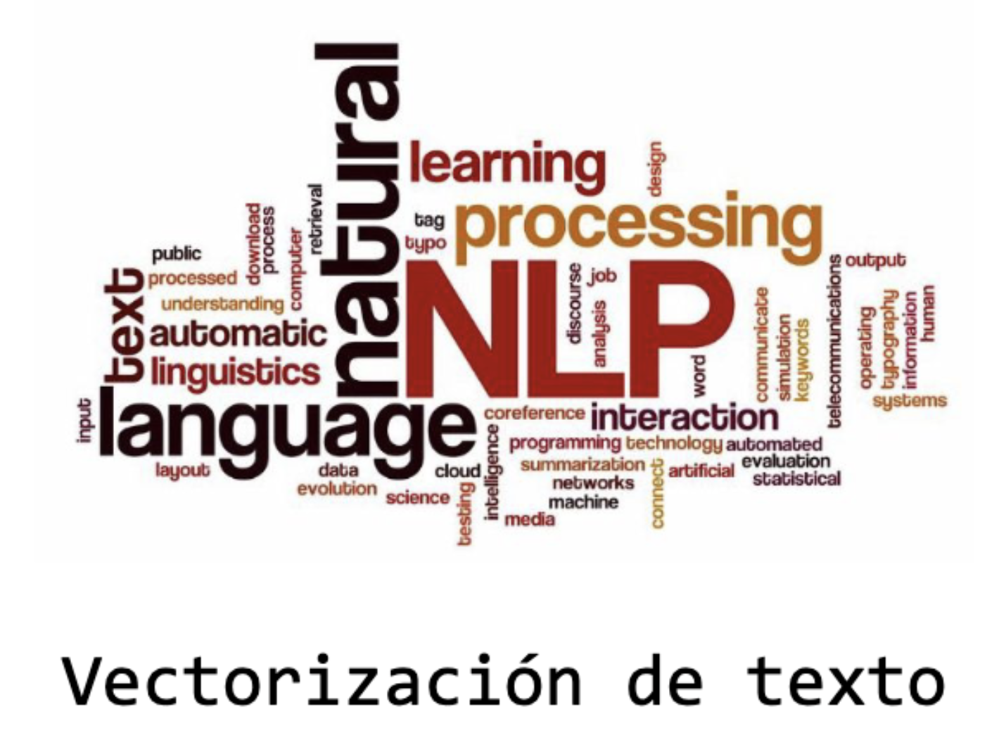
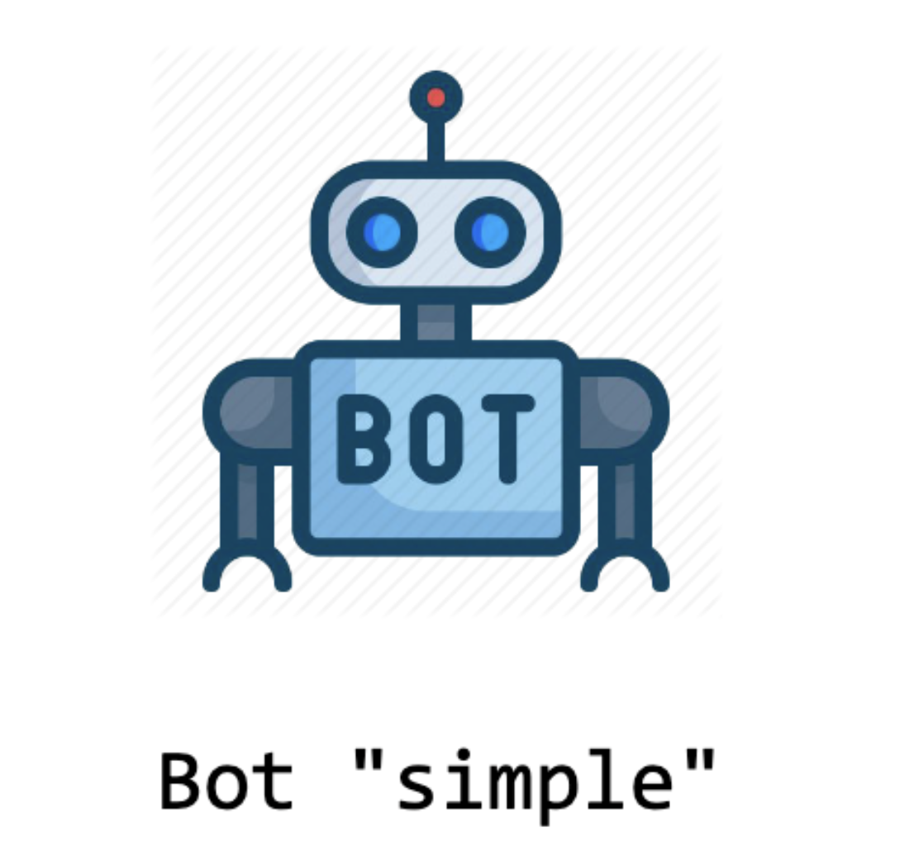
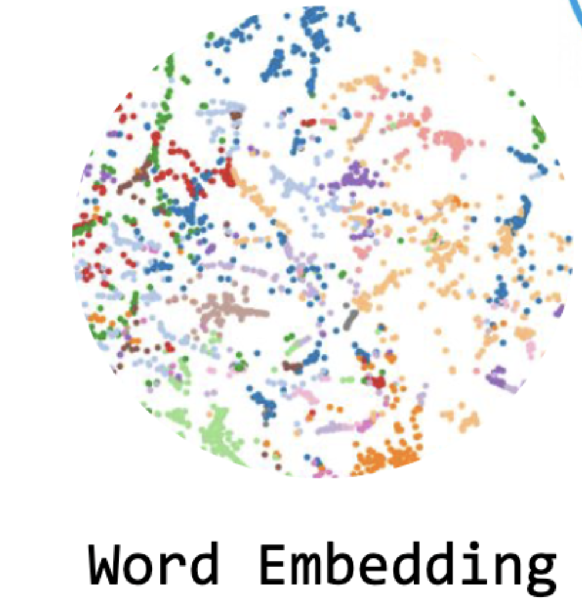
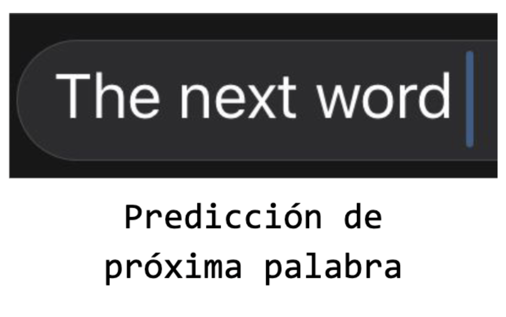
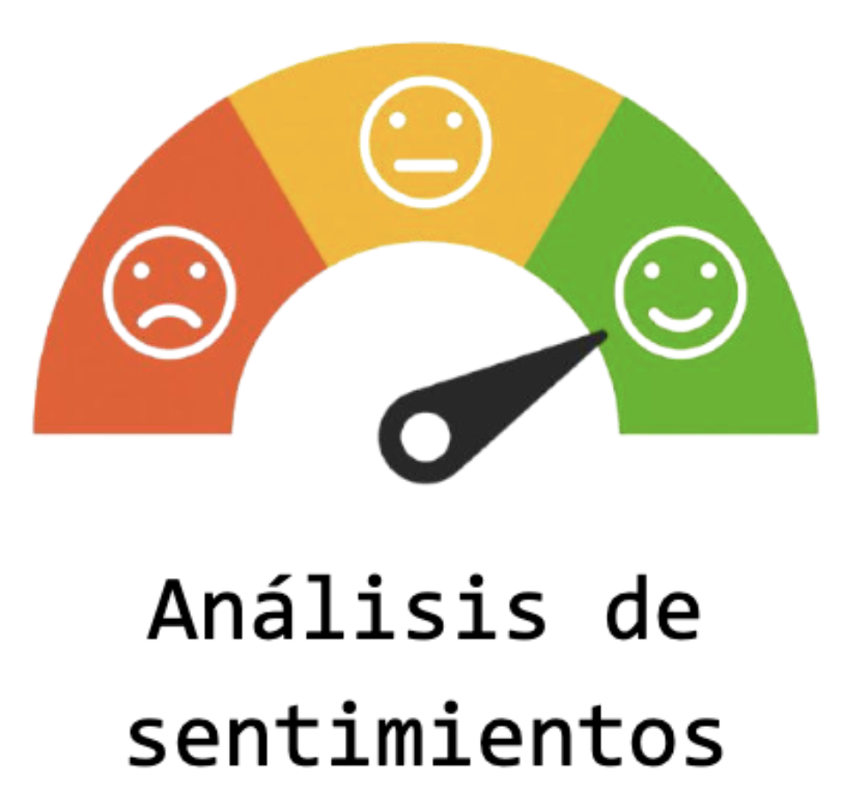
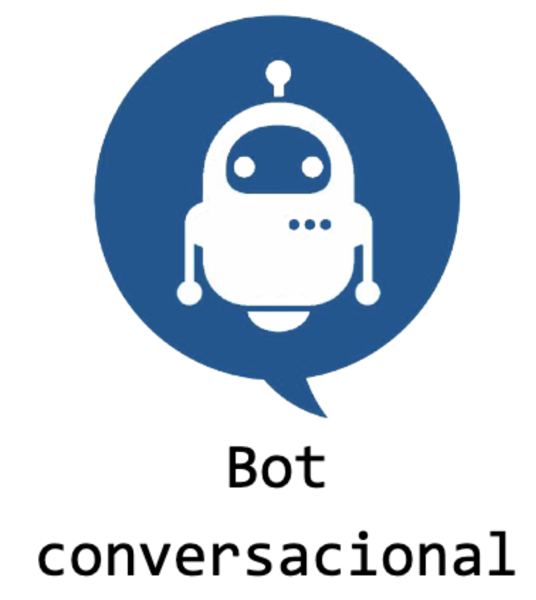

# :pencil: Natural Language Processing 

__Repositorio de la materia de Procesamiento de Lenguaje Natural de CEIA - Cohorte Nro 6 -  2022__ 

##  :game_die: Listado de Desafios Realizados

### :abcd: Vectorización de Texto

En este desafio se utilizaron los conceptos de OneHotEncoding, Vectores de frecuencia y TF-IDF.

El primer desafio tenia como objeto la introducción a conceptos de NLP y como realizar la vectorización de un texto. 

Puedes acceder al código del desafio haciendo click [AQUI](TP-1%20-Word2Vect/1a%20-%20word2vec.ipynb)

## :moyai: Simple chatbot

En este desafio se implementó la vectorización de texto previamente estudiada y como objetivo principal la implementación de un bot simple utilizando librerias de Spacy y TF-IDF.

Se utilizaron conceptos de procesamiento de texto, librerias de NLP y Rule-Based Bots.
Puedes acceder al código del desafio haciendo click [AQUI](TP-2%20-%20BOT/2a%20-%20bot.ipynb)

## :earth_americas: Word Embeddings

En este desafiose utilizaron los conceptos de corpus y documentos para poder crear embeddings de palabras utilizando CBOW Skipgram. 
Además se utilizó Gensim para la generación de embeddings.

Puedes acceder al código del desafio haciendo click [AQUI](TP-3%20-%20Embeddings/3%20-%20embeddings.ipynb)

## :parking: Predicción de próxima palabra

Para la realización de este desafio se utilizó RNN y LSTM. Se tomo el libro de Moby-Dick para generar el corpus y los embeddings. 

Se utilizaron estos embeddings generados junto con capas LSTM para realizar la predicción de posible próxima palabra.

Puedes acceder al código del desafio haciendo click [AQUI](TP-4%20-%20Proxima_Palabra/4%20-%20proxima_palabra.ipynb)

## :sunglasses: Análisis de Sentimientos con Embeddings + LSTM

Para este desafio se utilizó Embeddings y LSTM para poder clasificar las críticas de compradores de ropa que se caracteriza como un problema de analisis de sentimientos.

Se utilizó un dataset de criticas de compradores de ropa y se entrenaron modelos con embeddings preentrenados como entrenados en la misma red.

Una particularidad de este desafio, es que el dataset presentaba un desbalance en sus clases por lo que se tuvo que realizar un pre procesamiento de sus datos.

Puedes acceder al código del desafio haciendo click [AQUI](TP-5%20-%20Embedding%2BLSTM/5%20-%20clothing_ecommerce_reviews.ipynb)

## :robot: QA bot

El último desafio de la materia consiste en la utilización de redes LSTM enconder / decoder para contruir un BOT conversacional. 

Para lograr resolver este problema se utilizaron modelos Seq2Seq, traductores y ademá el modelo visto en clases de un bot conversacional. 

Puedes acceder al código del desafio haciendo click [AQUI](TP-6%20-%20QA-BOT%20/6-bot-qa.ipynb)

--- 

## :raised_hands: Agradecimientos

Se agradece a los profesores de la catedra NLP por compartir sus experiencias y conocimientos a traves del cursado.

- Esp. Ing. Hernán Contigiani
- Msc. Rodrigo Cardenas Szigety

## :construction_worker: Autor

- Esp. Ing. Domenje Carlos 

e-mail de contacto: carlosdomenje@gmail.com
linkedin: linkedin.com/in/carlos-domenje
